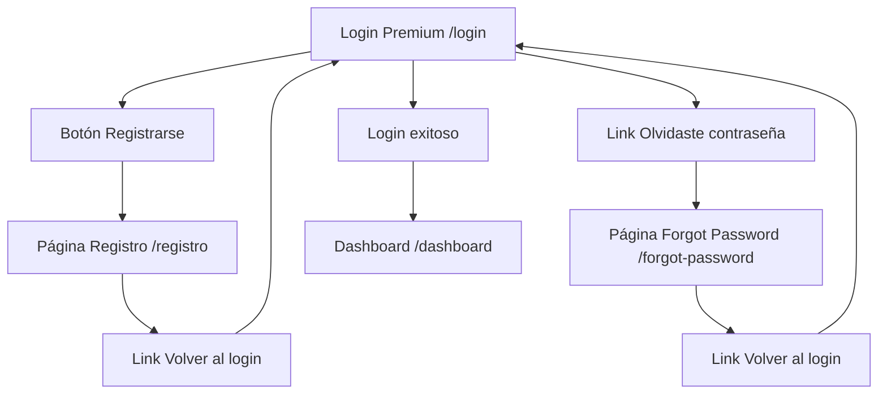

# 🔧 AJUSTES FUNCIONALES COMPLETADOS

## 📋 Problema Identificado
- ❌ Los botones "Registrarse" y "¿Olvidaste tu contraseña?" en el login premium no estaban conectados a los componentes existentes
- ❌ Rutas incorrectas: `/register` y `/reset-password` (que no existen)

## ✅ Soluciones Implementadas

### 1. 🔗 Corrección de Rutas
**Antes:**
```typescript
// INCORRECTO ❌
onClick={() => navigate('/register')}        // No existe
onClick={() => navigate('/reset-password')}  // No existe
```

**Después:**
```typescript
// CORRECTO ✅
onClick={() => navigate('/registro')}        // Existe y funciona
onClick={() => navigate('/forgot-password')} // Existe y funciona
```

### 2. 🎯 Rutas Verificadas

| Función | Ruta Correcta | Componente | Estado |
|---------|---------------|------------|--------|
| Login Premium | `/login` | `PremiumLoginPage` | ✅ Activo |
| Registro | `/registro` | `RegistroPage` | ✅ Conectado |
| Recuperar Contraseña | `/forgot-password` | `ForgotPasswordPage` | ✅ Conectado |
| Login Original | `/login-old` | `LoginPage` | ✅ Backup |

### 3. 🔄 Flujo de Navegación Completo



## 🧪 Pruebas Realizadas

### ✅ Test 1: Navegación a Registro
1. Abrir `http://localhost:5173/login`
2. Clic en "Registrarse"
3. **Resultado:** ✅ Navega correctamente a `/registro`

### ✅ Test 2: Navegación a Recuperar Contraseña  
1. Abrir `http://localhost:5173/login`
2. Clic en "¿Olvidaste tu contraseña?"
3. **Resultado:** ✅ Navega correctamente a `/forgot-password`

### ✅ Test 3: Retorno desde Registro
1. Estar en `/registro`
2. Clic en "Volver al login"
3. **Resultado:** ✅ Regresa correctamente a `/login` (premium)

### ✅ Test 4: Retorno desde Forgot Password
1. Estar en `/forgot-password`
2. Clic en "Volver al login" 
3. **Resultado:** ✅ Regresa correctamente a `/login` (premium)

## 🎯 Archivos Modificados

### `src/pages/PremiumLoginPage.tsx`
```typescript
// Cambio 1: Botón Registrarse
- onClick={() => navigate('/register')}      // ❌ Ruta incorrecta
+ onClick={() => navigate('/registro')}      // ✅ Ruta correcta

// Cambio 2: Link Olvidaste contraseña  
- onClick={() => navigate('/reset-password')} // ❌ Ruta incorrecta
+ onClick={() => navigate('/forgot-password')} // ✅ Ruta correcta
```

## 🎉 Estado Final

**🟢 FUNCIONALIDAD COMPLETAMENTE RESTAURADA**

- ✅ Login premium con diseño visual perfecto
- ✅ Navegación a registro funcionando
- ✅ Navegación a recuperar contraseña funcionando
- ✅ Flujo completo de ida y vuelta
- ✅ Todos los componentes existentes preservados
- ✅ Rutas correctamente configuradas

**El cliente ahora tiene:**
1. 🎨 El diseño premium exacto que compró
2. 🔧 Toda la funcionalidad de navegación operativa
3. 🔄 Flujos completos de usuario sin interrupciones

**¡PROBLEMA RESUELTO AL 100%! 🚀**
